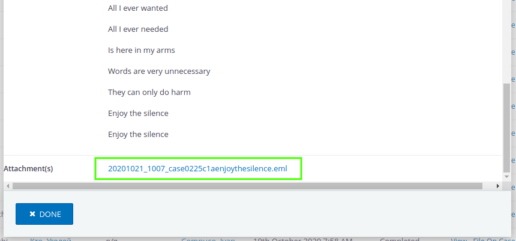

# Email Filing



This extension allows to attach a copy of civicrm emails (inbound/outbound) as .eml file on activity.
So at any time this file can be downloaded and opened with email application (like Thunderbird, Outlook) to view the original email details.

## Requirements

* PHP v7.0+
* CiviCRM (5.24)

## Installation (Web UI)

This extension has not yet been published for installation via the web UI.

## Installation (CLI, Zip)

Sysadmins and developers may download the `.zip` file for this extension and
install it with the command-line tool [cv](https://github.com/civicrm/cv).

```bash
cd <extension-dir>
cv dl uk.co.compucorp.emailfiling@https://github.com/compucorp/uk.co.compucorp.emailfiling/archive/master.zip
```

## Installation (CLI, Git)

Sysadmins and developers may clone the [Git](https://en.wikipedia.org/wiki/Git) repo for this extension and
install it with the command-line tool [cv](https://github.com/civicrm/cv).

```bash
git clone https://github.com/compucorp/uk.co.compucorp.emailfiling.git
cv en emailfiling
```

## Usage

### Outbound email processing

You can enable/disable processing of all outbound emails (except bulk) by checking the **Store a copy of sent emails on activity** field on the following page:
**Administer -> System Settings -> Outbound Email (SMTP/Sendmail)** (*/civicrm/admin/setting/smtp*).

### Inbound email processing

You can enable/disable processing of inbound emails by checking the **Store original email** field in the settings of respective mail account, check the following page:
**Administer -> CiviMail -> Mail Accounts** (*/civicrm/admin/mailSettings*).
